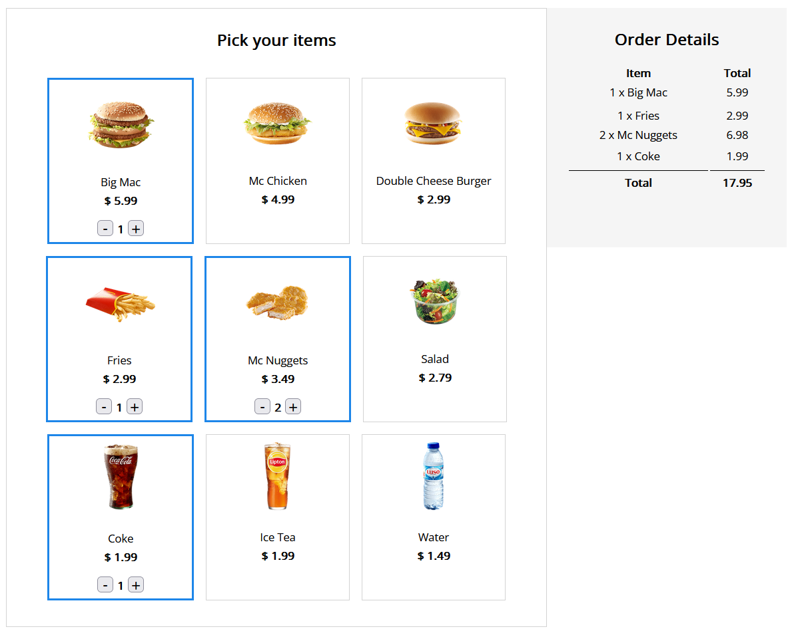

# Self Service Machine - API Option

Le but est de réaliser l'application Self Service Machine avec Vue.js 3 et l'API Option.

Pour y parvenir, je vous propose une suite d'étapes qui me paraît logique.

Pour les élèves les plus aguerris, vous pouvez bien sûr faire du hors piste.

## Step0 : Le code de départ

Dans cette étape, vous devez simplement étudier le code de départ.

Voila ! On est prêt pour démarrer le développement de notre applicaton Vue.js.

## Step1 : Créer l'instance de Vue

Dans cette étape, vous devez :

- ajouter le CDN de Vue dans index.html
- créer une instance de Vue
- définir dans la méthode `data()` les produits à l'aide de la variable `products` fournie

## Step2 : Afficher les produits

Dans cette étape, vous devez :

- supprimer le code HTML des produits et n'en garder qu'un produit
- utiliser la directive v-for pour afficher tous les produits
- récupérer les différents données des produits à savoir le nom, le prix la quantité et la photo
- et les afficher dans le HTML

## Step3 : Gérer la sélection des produits

Dans cette étape, vous devez gérer la sélection d'un produit.

Pour cela, chaque produit a un attribut `active` que vous devez exploiter.

Il existe également une class CSS `selected` a utiliser pour chaque produit sélectionné.

Attention ! C'est simplement la sélection, on ne s'occupe pas de la commande pour l'instant.

## Step4 : Gérer les boutons + et -

Dans cette étape, vous devez :

- l'affichage des boutons + - qui ne doivent être affichés que si le produit est sélectionné.
- diminuer ou augmenter la quantité du produit

Attention à ne peut pas avoir une quantité négative.

Pour ce faire, on doit désactiver le bouton - si la quantité est <=1

Attention également au clique sur les boutons + et -.

Ce clique ne doit pas sélectionner ou désélectionner le produit.

Pour cela, vous devez arrêter la propagation de l'événement.

Pour plus d'infos sur le sujet :

https://v2.fr.vuejs.org/v2/guide/events.html#Modificateurs-d%E2%80%99evenements

## Step6 : Afficher les détails de la commande

Dans cette étape, vous devez gérer le détail de la commande.

C'est à dire qu'à chaque fois qu'un produit est sélectionné, une ligne dans le détail de la commande doit s'ajouter avec le bon montant : quantité x prix du produit.

## Step7 : Calculer le total de la commande

Dans cette étape, vous devez gérer le total de la commande.

Pour cela vous devez créer une méthode `calculateTotal()`

## Step8 : Composants

Dans cette étape, vous devez créer 3 composants :

- ProductList.js
- ProductDetail.js
- OrderDetail.js

Vérifier bien que l'application est à 100 % opérationnelle !

## Conclusion

Bravo ! Vous avez réussi !

Grâce à cet exercice, vous avez appliqué les concepts étudiés dans l'introduction à Vue.js 3.

Maintenant, il est temps de comprendre l'API Composition de Vue et ensuite Vue Router puis enfin la communication avec le backend.
